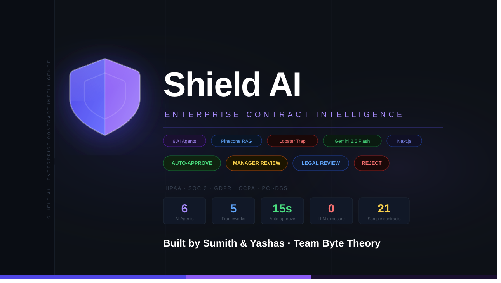
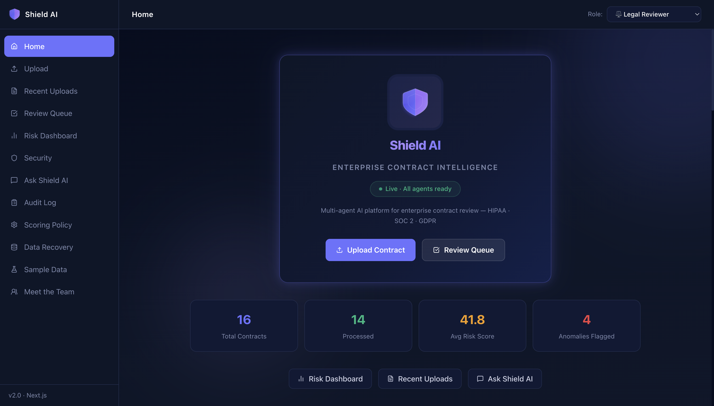
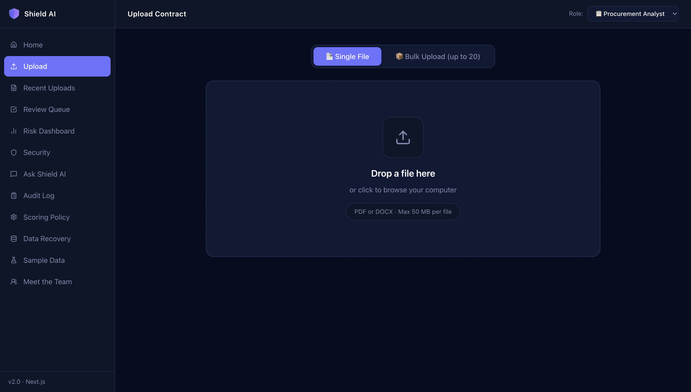
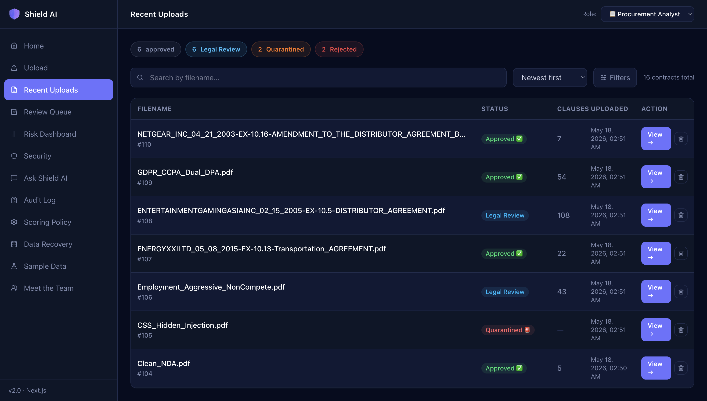
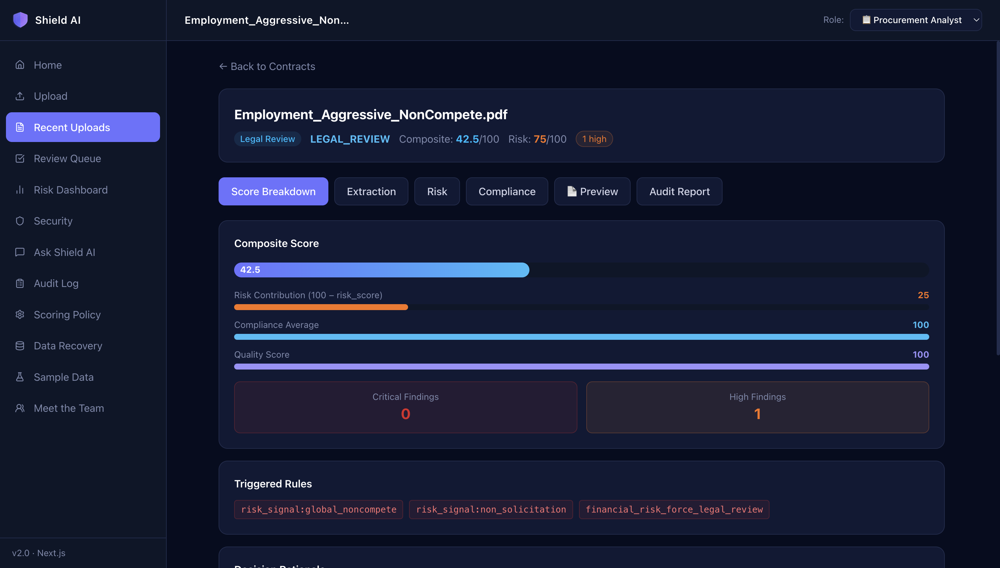
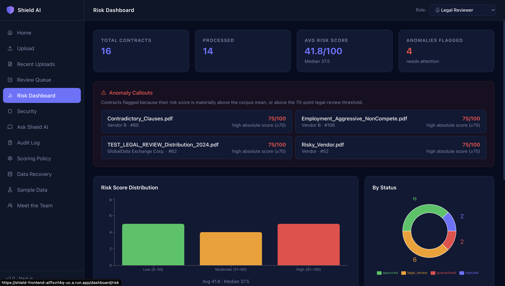
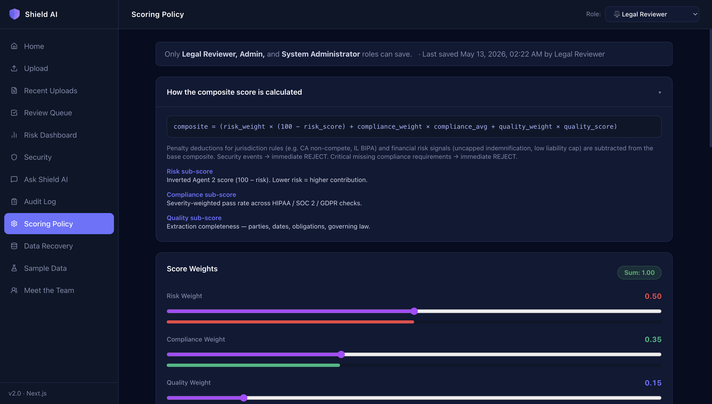
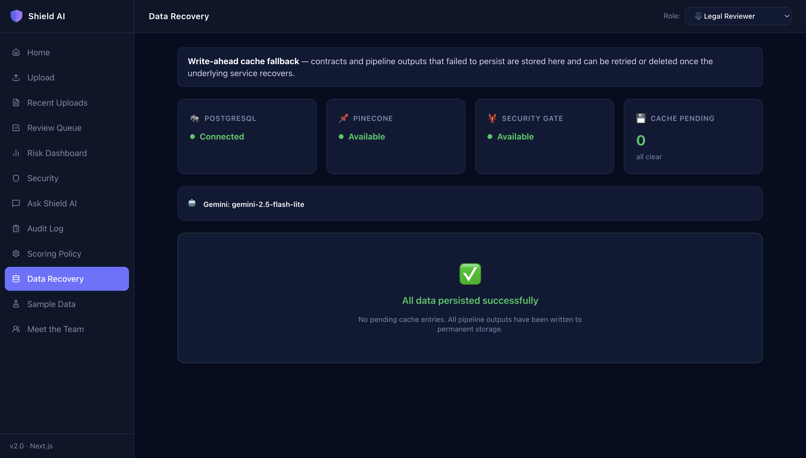

#  Shield AI — Enterprise Contract Risk Assessment Platform

<div align="center">



**AI-powered contract governance · From upload to decision in under 90 seconds**

[](https://shield-frontend-aiffxvrl4q-uc.a.run.app)
[](https://shield-backend-aiffxvrl4q-uc.a.run.app/docs)
[](public/Shield_AI_latest.pdf)

</div>

---

## 🎬 Video Demo

> **Demo video coming soon.**
>
> <!-- TODO: Replace this block with the actual video embed once recorded -->
>
> [](#)
>
> _Full walkthrough of the upload pipeline, security gate, risk assessment, compliance check, review queue, and Ask Shield AI — ~5 minutes._

---

## 📊 Presentation

The full pitch deck is available in this repository:

| Format            | Link                                                           |
| ----------------- | -------------------------------------------------------------- |
| 📄 **PDF**        | [`public/Shield_AI_latest.pdf`](public/Shield_AI_latest.pdf)   |
| 📑 **PowerPoint** | [`public/Shield_AI_latest.pptx`](public/Shield_AI_latest.pptx) |

---

## Table of Contents

- [Overview](#overview)
- [Screenshots](#screenshots)
- [Key Features](#key-features)
- [Architecture](#architecture)
- [Agent Pipeline](#agent-pipeline)
- [Tech Stack](#tech-stack)
- [Project Structure](#project-structure)
- [Application Pages](#application-pages)
- [Backend API](#backend-api)
- [Database Schema](#database-schema)
- [Roles & Permissions](#roles--permissions)
- [Scoring Policy](#scoring-policy)
- [Prerequisites](#prerequisites)
- [Environment Variables](#environment-variables)
- [Local Development](#local-development)
- [Docker — Local Production Stack](#docker--local-production-stack)
- [Deployment — Google Cloud Run](#deployment--google-cloud-run)
- [Teardown](#teardown)
- [Running Tests](#running-tests)
- [Sample Contracts](#sample-contracts)
- [Makefile Reference](#makefile-reference)
- [Team](#team)

---

## Overview

Enterprise legal teams process hundreds of contracts monthly — NDAs, vendor agreements, employment contracts, data processing addenda — each requiring expert review for risk, compliance violations, and adversarial content. This is slow, expensive, and error-prone.

Shield AI solves this by:

1. **Extracting** structured metadata (parties, dates, clauses, obligations) from raw PDFs and DOCX files.
2. **Scoring** contracts against a configurable risk policy with per-clause weighting.
3. **Checking** regulatory compliance (HIPAA, GDPR, CCPA, PCI-DSS, SOC 2) using RAG over a proprietary policy corpus.
4. **Blocking** adversarial documents before they reach any LLM — prompt injection, hidden text, CSS-based attacks via Lobster Trap.
5. **Routing** contracts to the right human reviewer based on risk score and violation severity.
6. **Logging** every agent decision and human action to an immutable, append-only audit trail.

Low-risk contracts auto-approve in ~60 seconds. High-risk contracts are routed to the right reviewer with AI-generated rationale and clause-level findings. Adversarial contracts are quarantined before any LLM ever sees them.

---

## Screenshots

### 🏠 Home Page



> System health indicators (PostgreSQL, Pinecone, Lobster Trap), live contract stats, and pipeline overview.

---

### 📤 Upload Page



> Drag-and-drop PDF/DOCX upload with a **real-time 5-step pipeline tracker** — streams live from the backend via Server-Sent Events. No polling, no page refresh.

---

### 📋 Recent Uploads



> Filterable and sortable contract table with status chips, risk scores, and one-click delete.

---

### 🔍 Contract Details



> Full extraction output, clause-level risk breakdown, compliance report (framework by framework), scoring breakdown with composite score, and complete decision history.

---

### ✅ Review Queue


> Role-gated review queue — Legal Reviewers, Compliance Officers, and Managers each see only what requires their attention. Supports approve, reject, escalate, assign, and comment.

---

### 📊 Risk Dashboard



> Portfolio-level risk view — score distribution chart, high-risk contract list, status breakdown, and trend analytics.

---

### 🛡️ Security Dashboard


> Security event timeline, threat type breakdown, and quarantine history with the specific reason each contract was blocked.

---

### 💬 Ask Shield AI


> Natural language queries across the full contract library — powered by Gemini 2.5 and Pinecone semantic search. Ask anything: _"Which contracts have uncapped liability?"_, _"Show all GDPR compliance failures."_

---

### 📁 Audit Log


> Immutable, filterable, paginated audit trail of every action — every agent run, every human decision, every upload, every assignment. Exactly what regulators want to see.

---

### ⚙️ Scoring Policy



> Live policy editor — adjust risk weights, routing thresholds, and framework rejection rules at runtime with no code changes or redeploys needed. Includes a built-in risk simulator.

---

### 📚 Sample Data


> 21 ready-to-use contracts (synthetic + SEC real-world filings) with in-browser PDF preview, direct download, and one-click upload to the pipeline.

---

### 🔄 Data Recovery



> System health details, cache management, and database status — for diagnosing and recovering from infrastructure issues.

---

### 👥 Meet the Team


> The Byte Theory team page with animated glassmorphism cards.

---

## Key Features

| Feature                            | Description                                                                                                                                                                 |
| ---------------------------------- | --------------------------------------------------------------------------------------------------------------------------------------------------------------------------- |
| **Multi-Agent Pipeline**           | 5 specialised agents (Classification → Extraction → Risk → Compliance → Approval) running in sequence with structured Pydantic output                                       |
| **Lobster Trap Security Gate**     | Veea Lobster Trap DPI proxy + offline pattern detector runs before any LLM; quarantines prompt injections, adversarial payloads, hidden text, and CSS-based attacks         |
| **Live Pipeline Streaming**        | Server-Sent Events push real-time agent status to the browser — no polling, no page refresh                                                                                 |
| **RAG**                            | Gemini `embedding-001` embeddings over past contracts, HIPAA/GDPR/SOC2 policies, and regulatory frameworks; retrieved at risk and compliance agents                         |
| **Configurable Scoring**           | Weighted policy (clause weights, thresholds, framework rejection rules) editable at runtime without code changes                                                            |
| **Role-Based Review Queue**        | Six roles with separate queues, assignment flow, and commenting — Legal Reviewer and Compliance Officer can assign contracts; Executives and Auditors have read-only access |
| **Auto Multi-Reviewer Assignment** | Compliance failures auto-assign the Compliance Officer; Critical risk findings auto-assign the Legal Reviewer — no manual handoffs                                          |
| **Ask Shield AI**                  | Natural language queries answered by Agent 6 (contract Q&A with citations) or Agent 7 (text-to-SQL across the full corpus)                                                  |
| **Audit Log**                      | Every agent call, human decision, upload, and assignment is logged with actor, action, timestamp, and full context                                                          |
| **Dashboards**                     | Live risk dashboard (score distribution, high-risk contracts) and security dashboard (event timeline, quarantine history with reasons)                                      |
| **Duplicate Detection**            | SHA-256 file hash deduplication — re-uploading an existing contract shows a direct link to the existing review instead of re-processing                                     |
| **Sample Data**                    | 21 synthetic and real-world contracts (SEC filings) with in-browser PDF preview and direct upload to the pipeline                                                           |

---

## Architecture

```
Browser (Next.js 16)
        │
        │  HTTPS — same-origin requests only
        ▼
/api/backend/[...path]         Next.js API proxy route (eliminates CORS,
        │                      keeps backend URL private from the browser)
        │  Server-to-server HTTP
        ▼
FastAPI (port 8000)
        │
        ├── Security Gate ──────────────►  Veea Lobster Trap DPI proxy
        │   (runs BEFORE any LLM)           + offline pattern matcher
        │
        ├── Agent Pipeline ─────────────►  Google Gemini 2.5 Flash / Pro
        │   (Orchestrator)
        │
        ├── RAG Layer ──────────────────►  Pinecone (vector store, prod)
        │                                   FAISS (in-memory corpus, dev)
        │
        ├── Storage ────────────────────►  PostgreSQL / Cloud SQL (prod)
        │                                   SQLite (local dev, default)
        │                                   Google Cloud Storage (files)
        │
        └── Audit Log ──────────────────►  audit_logs table (append-only)
```

**Three deployed services** (local Docker or Google Cloud Run):

| Service              | Port | Purpose                                        |
| -------------------- | ---- | ---------------------------------------------- |
| `shield-backend`     | 8000 | FastAPI REST API, agent pipeline, database     |
| `shield-frontend`    | 3000 | Next.js UI — proxies all API calls server-side |
| `shield-lobstertrap` | 8080 | Veea DPI security proxy (internal-only)        |

---

## Agent Pipeline

Each uploaded contract passes through a sequential pipeline. The Security Gate runs synchronously at upload time; all remaining agents run in a background task and stream progress to the UI via Server-Sent Events.

| #     | Agent                | Model                | Description                                                                                                                                                                                                     |
| ----- | -------------------- | -------------------- | --------------------------------------------------------------------------------------------------------------------------------------------------------------------------------------------------------------- |
| **0** | **Security Gate**    | Lobster Trap + regex | Runs first, before any LLM. Scans for prompt injection, hidden text (white-on-white, CSS-invisible), adversarial payloads. Quarantines on match — the LLM never sees the document.                              |
| **1** | **Classification**   | Gemini 2.5 Flash     | Identifies contract type (NDA, Vendor, Employment, DPA, SaaS…), governing jurisdiction, sector, and applicable compliance frameworks.                                                                           |
| **2** | **Extraction**       | Gemini 2.5 Flash     | Structured extraction of all clauses with title, full text, page number, and clause type. RAG retrieves similar past contracts for context.                                                                     |
| **3** | **Risk Assessment**  | Gemini 2.5 Pro       | Scores each clause for risk. Produces an overall risk score 0–100. RAG retrieves prior risk findings for context-aware scoring.                                                                                 |
| **4** | **Compliance**       | Gemini 2.5 Flash     | Checks against HIPAA, GDPR, CCPA, SOC 2, PCI-DSS, FERPA, CMMC requirements using RAG over the policy corpus. Returns a violation list with severity.                                                            |
| **5** | **Approval Routing** | Rules-based (no LLM) | Converts risk score + compliance violations + scoring policy into a deterministic recommendation: `AUTO_APPROVE`, `MANAGER_REVIEW`, `LEGAL_REVIEW`, or `REJECT`. Writes a templated rationale. Fully auditable. |

Two additional agents handle on-demand queries from the **Ask Shield AI** page:

| Agent            | Trigger                       | Purpose                                                                                                     |
| ---------------- | ----------------------------- | ----------------------------------------------------------------------------------------------------------- |
| **Contract Q&A** | Query with a `contract_id`    | Answers natural language questions about a specific contract with clause-level citations                    |
| **Analytics**    | Query without a `contract_id` | Text-to-SQL — translates natural language questions into SQL and runs them against the full contract corpus |

**Pipeline guarantees:**

- All agent outputs are **Pydantic-validated JSON** — no free-form strings flow downstream.
- RAG context (past contracts + policy snippets) is injected at agents 2, 3, and 4.
- A single agent failure does not abort the pipeline; the contract is only marked `pipeline_failed` if all agents fail.
- Per-step status is written to the DB before each agent runs, so the frontend tracker reflects true progress.

---

## Tech Stack

### Backend

| Component       | Technology                                |
| --------------- | ----------------------------------------- |
| API framework   | FastAPI 0.110+                            |
| ORM             | SQLAlchemy 2.0                            |
| Database (dev)  | SQLite                                    |
| Database (prod) | PostgreSQL (Cloud SQL)                    |
| Migrations      | Alembic                                   |
| LLM             | Google Gemini 2.5 Flash / Pro             |
| Embeddings      | Gemini `embedding-001`                    |
| Vector store    | Pinecone (production) + FAISS (in-memory) |
| File storage    | Google Cloud Storage                      |
| Security proxy  | Veea Lobster Trap                         |
| PDF parsing     | pdfplumber                                |
| DOCX parsing    | python-docx                               |

### Frontend

| Component    | Technology                                 |
| ------------ | ------------------------------------------ |
| Framework    | Next.js 16.2 (App Router)                  |
| Language     | TypeScript 5                               |
| Styling      | Tailwind CSS 4                             |
| Charts       | Recharts                                   |
| Icons        | Lucide React                               |
| Live updates | Server-Sent Events (EventSource)           |
| HTTP         | Native `fetch` via Next.js API proxy route |

### Infrastructure

| Component      | Technology               |
| -------------- | ------------------------ |
| Containers     | Docker                   |
| CI/CD          | Google Cloud Build       |
| Hosting        | Google Cloud Run         |
| Image registry | Google Artifact Registry |
| Secrets        | Google Secret Manager    |

---

## Project Structure

```
Shield-AI/
│
├── public/                            # Static assets & presentations
│   ├── Shield_AI_latest.pdf           # Pitch deck (PDF)
│   ├── Shield_AI_latest.pptx          # Pitch deck (PowerPoint)
│   ├── shield_ai_cover_16x9_v2.svg    # Cover image
│   └── images/                        # Application screenshots
│       ├── HomePage.png
│       ├── UploadPage.png
│       ├── ContractDetails.png
│       ├── RecentUploads.png
│       ├── Review Queue.png
│       ├── RiskDashboard.png
│       ├── Security Dashboard.png
│       ├── Ask Shield AI.png
│       ├── Audit log.png
│       ├── ScoringPolicy.png
│       ├── Sample Data.png
│       ├── DataRecovery.png
│       └── Meet the Team.png
│
├── backend/                           # FastAPI application
│   ├── main.py                        # App entry point, CORS, lifespan (RAG init)
│   ├── models.py                      # SQLAlchemy ORM models
│   ├── db.py                          # Database session management
│   ├── orchestrator.py                # Agent pipeline runner
│   ├── extractors.py                  # PDF / DOCX text extraction
│   ├── segmentation.py                # Clause regex segmentation
│   ├── llm.py                         # Gemini wrapper with retry / backoff
│   ├── gemini_client.py               # Gemini API client
│   ├── lobstertrap.py                 # Lobster Trap DPI proxy client
│   ├── audit.py                       # Audit log writer (single source of truth)
│   ├── cache.py                       # Embedding cache management
│   ├── logging_config.py              # Daily rotating log setup
│   │
│   ├── api/                           # FastAPI routers (one file per domain)
│   │   ├── contracts.py               # Upload, list, detail, decide, assign, delete, SSE stream
│   │   ├── dashboard.py               # Risk & security summary aggregation
│   │   ├── audit_logs.py              # Filterable, paginated audit log
│   │   ├── query.py                   # Natural language query (Ask Shield AI)
│   │   ├── scoring.py                 # Scoring policy CRUD
│   │   ├── rag.py                     # RAG debug (status, search)
│   │   └── health.py                  # Health check + data recovery
│   │
│   ├── agents/                        # One file per agent
│   │   ├── classifier.py              # Agent 0 – Contract classification
│   │   ├── extraction.py              # Agent 1 – Structured clause extraction
│   │   ├── risk.py                    # Agent 2 – Risk scoring + RAG
│   │   ├── compliance.py              # Agent 3 – Compliance + RAG
│   │   ├── security.py                # Agent 4 – Lobster Trap + offline detector
│   │   ├── recommendation.py          # Agent 5 – Approval routing (rules-based)
│   │   ├── contract_qa.py             # Agent 6 – Q&A with citations
│   │   ├── analytics.py               # Agent 7 – Text-to-SQL
│   │   ├── scoring.py                 # Scoring engine & default policy
│   │   ├── schemas.py                 # Pydantic output schemas for all agents
│   │   ├── registry.py                # Agent registry & metadata
│   │   └── history.py                 # Decision history tracking
│   │
│   ├── rag/                           # Retrieval-Augmented Generation layer
│   │   ├── embed.py                   # Gemini embedding-001 wrapper
│   │   ├── index.py                   # FAISS in-memory indexing
│   │   ├── ingest.py                  # Corpus ingestion pipeline
│   │   ├── retrieve.py                # Query retrieval helper
│   │   └── cache/                     # Persistent embedding cache (disk)
│   │
│   ├── corpus/                        # Read-only reference data (bundled in image)
│   │   ├── past_contracts/            # Anonymised prior contracts for RAG
│   │   ├── policies/                  # HIPAA, SOC 2, GDPR policy snippets
│   │   └── regulations/               # Regulatory framework documents
│   │
│   └── uploads/                       # Uploaded contract files (local dev only)
│
├── frontend-next/                     # Next.js 16 frontend
│   ├── src/
│   │   ├── app/                       # Next.js App Router pages
│   │   │   ├── layout.tsx             # Root layout (Sidebar + main area)
│   │   │   ├── api/backend/
│   │   │   │   └── [...path]/
│   │   │   │       └── route.ts       # Proxy: /api/backend/* → FastAPI (+ SSE passthrough)
│   │   │   ├── home/page.tsx          # Dashboard home (health, stats, pipeline)
│   │   │   ├── upload/page.tsx        # Upload with real-time SSE pipeline progress
│   │   │   ├── contracts/
│   │   │   │   ├── page.tsx           # Recent uploads (filter, sort, delete)
│   │   │   │   └── [id]/page.tsx      # Contract detail (clauses, risk, decisions)
│   │   │   ├── queue/page.tsx         # Review queue (role-based, assign, comment)
│   │   │   ├── dashboard/
│   │   │   │   ├── risk/page.tsx      # Risk dashboard (score distribution, charts)
│   │   │   │   └── security/page.tsx  # Security dashboard (events, quarantine)
│   │   │   ├── ask/page.tsx           # Ask Shield AI (NL query interface)
│   │   │   ├── audit/page.tsx         # Audit log (filterable, paginated)
│   │   │   ├── scoring/page.tsx       # Scoring policy editor + live simulator
│   │   │   ├── recovery/page.tsx      # Data recovery (health, cache, DB status)
│   │   │   ├── samples/page.tsx       # Sample contracts (preview + download)
│   │   │   └── team/page.tsx          # Meet the Team — Byte Theory
│   │   │
│   │   ├── components/
│   │   │   ├── layout/
│   │   │   │   ├── Sidebar.tsx        # Navigation sidebar (all routes)
│   │   │   │   └── Topbar.tsx         # Page header bar
│   │   │   └── ui/
│   │   │       ├── StatusPill.tsx     # Coloured contract status badge
│   │   │       └── ScoreBar.tsx       # Animated risk score bar
│   │   │
│   │   └── lib/
│   │       ├── api.ts                 # Typed API client (all endpoints)
│   │       ├── roles.ts               # Role definitions, permissions, queues
│   │       └── utils.ts               # cn(), fmtDate(), status helpers
│   │
│   ├── public/
│   │   ├── shield-ai-icon.svg         # Two-colour shield logo (SVG)
│   │   ├── byte-theory-logo.svg       # Byte Theory team logo (SVG)
│   │   └── samples/                   # 21 sample PDFs served as static assets
│   │
│   ├── next.config.ts                 # output: standalone (required for Docker)
│   ├── tailwind.config.ts
│   └── tsconfig.json
│
├── alembic/                           # Database migrations
│   ├── env.py
│   └── versions/
│       ├── 99733a20d3e2_initial_schema.py
│       └── a1b2c3_add_comments_and_assignments.py
│
├── scripts/
│   ├── setup_and_deploy.py            # 🚀 Full cold-start GCP provisioning + deploy (12 steps)
│   ├── teardown.py                    # 🧹 Full infrastructure teardown (Cloud Run, AR, GCS, Pinecone, secrets)
│   ├── dev.py                         # Local dev launcher (uvicorn + Lobster Trap)
│   ├── build_demo_contracts.py        # Generate synthetic test contracts
│   ├── demo_smoke_test.py             # Pipeline regression test
│   └── generate_test_contracts.py     # Bulk synthetic contract generator
│
├── tests/                             # 14 test files, 80+ unit/integration tests
│   ├── conftest.py                    # Fixtures, mocked Gemini client
│   ├── test_extraction.py
│   ├── test_risk_compliance.py
│   ├── test_recommendation.py
│   ├── test_analytics.py
│   ├── test_contract_qa.py
│   ├── test_rag.py
│   ├── test_pipeline.py
│   ├── test_lobstertrap.py
│   ├── test_dashboard.py
│   ├── test_audit_report.py
│   └── test_health.py
│
├── demo_contracts/                    # 21 sample contracts (synthetic + SEC filings)
├── prompts/                           # Versioned LLM prompt templates
├── logs/                              # Runtime logs (daily rotation)
│
├── Dockerfile                         # Backend image (Python 3.11, Cloud Run)
├── frontend-next.Dockerfile           # Next.js image (multi-stage Alpine, Cloud Run)
├── lobstertrap.Dockerfile             # Lobster Trap DPI proxy image
├── docker-compose.yml                 # Local 3-container stack
│
├── cloudbuild.yaml                    # Cloud Build CI/CD pipeline
├── cloudrun-backend.yaml              # Cloud Run backend service manifest
├── cloudrun-frontend.yaml             # Cloud Run frontend service manifest
├── Makefile                           # All build / dev / deploy targets
├── requirements.txt                   # Python dependencies
├── alembic.ini                        # Alembic configuration
└── .env.example                       # Environment variable template
```

---

## Application Pages

| Route                 | Page               | Description                                                                        |
| --------------------- | ------------------ | ---------------------------------------------------------------------------------- |
| `/home`               | Home               | System health (PostgreSQL, Pinecone, Security Gate), live stats, pipeline overview |
| `/upload`             | Upload             | Drag-and-drop PDF upload with real-time SSE agent progress tracker                 |
| `/contracts`          | Recent Uploads     | Filterable / sortable contract table with status chips and delete                  |
| `/contracts/[id]`     | Contract Detail    | Full clause list, risk breakdown, agent outputs, decision history                  |
| `/queue`              | Review Queue       | Role-gated review queue with assignment, commenting, and approve/reject            |
| `/dashboard/risk`     | Risk Dashboard     | Score distribution chart, high-risk contracts, status breakdown                    |
| `/dashboard/security` | Security Dashboard | Security event timeline, threat type breakdown, quarantine history with reasons    |
| `/ask`                | Ask Shield AI      | Natural language query — contract Q&A or corpus-wide analytics                     |
| `/audit`              | Audit Log          | Filterable, paginated audit trail of every action                                  |
| `/scoring`            | Scoring Policy     | Live policy editor (weights, thresholds, rejection rules) + risk simulator         |
| `/recovery`           | Data Recovery      | System health details, cache flush, database status                                |
| `/samples`            | Sample Data        | 21 sample contracts with in-browser PDF preview, download, and upload-to-pipeline  |
| `/team`               | Meet the Team      | Byte Theory team profiles with contact details                                     |

---

## Backend API

All endpoints served at `http://localhost:8000`. Interactive docs at `/docs`.

### Contracts — `/contracts`

| Method   | Path                      | Description                                                                           |
| -------- | ------------------------- | ------------------------------------------------------------------------------------- |
| `POST`   | `/contracts/upload`       | Upload a single PDF/DOCX; triggers the 5-agent pipeline                               |
| `POST`   | `/contracts/bulk-upload`  | Upload multiple files in one request                                                  |
| `GET`    | `/contracts/`             | List contracts (filter by status, paginated)                                          |
| `GET`    | `/contracts/{id}`         | Full contract detail with agent outputs and decisions                                 |
| `GET`    | `/contracts/{id}/stream`  | **SSE stream** — pushes `{"status": "..."}` events every 500 ms until terminal status |
| `POST`   | `/contracts/{id}/decide`  | Submit a human approve/reject decision                                                |
| `POST`   | `/contracts/{id}/assign`  | Assign to another role (Legal Reviewer / Compliance Officer only)                     |
| `POST`   | `/contracts/{id}/comment` | Post a comment on a contract                                                          |
| `DELETE` | `/contracts/{id}`         | Delete contract + clauses + Pinecone vectors + GCS file                               |

### Dashboard — `/dashboard`

| Method | Path                          | Description                                               |
| ------ | ----------------------------- | --------------------------------------------------------- |
| `GET`  | `/dashboard/risk-summary`     | Risk score distribution, high-risk list, status counts    |
| `GET`  | `/dashboard/security-summary` | Security event counts, threat breakdown, quarantine stats |

### Query — `/query`

| Method | Path      | Description                                                                     |
| ------ | --------- | ------------------------------------------------------------------------------- |
| `POST` | `/query/` | NL query — routes to contract Q&A (with `contract_id`) or text-to-SQL (without) |

### Scoring Policy — `/scoring-policy`

| Method | Path                       | Description                          |
| ------ | -------------------------- | ------------------------------------ |
| `GET`  | `/scoring-policy/`         | Current active policy with metadata  |
| `PUT`  | `/scoring-policy/`         | Replace active policy                |
| `GET`  | `/scoring-policy/history`  | All historical policy versions       |
| `GET`  | `/scoring-policy/defaults` | The built-in default policy constant |

### Audit Log — `/audit-logs`

| Method | Path           | Description                                                              |
| ------ | -------------- | ------------------------------------------------------------------------ |
| `GET`  | `/audit-logs/` | Filterable, paginated audit log (actor, action, contract_id, date range) |

### Health & Recovery — `/health`

| Method | Path                  | Description                                        |
| ------ | --------------------- | -------------------------------------------------- |
| `GET`  | `/health`             | Database, Pinecone, Lobster Trap, and cache status |
| `POST` | `/health/flush-cache` | Clear the embedding cache                          |

### RAG Debug — `/rag`

| Method | Path                | Description                         |
| ------ | ------------------- | ----------------------------------- |
| `GET`  | `/rag/status`       | Loaded indices and entry counts     |
| `GET`  | `/rag/search?q=...` | Top-k retrieval results with scores |

---

## Database Schema

| Table                  | Description                                                                                             |
| ---------------------- | ------------------------------------------------------------------------------------------------------- |
| `contracts`            | Core contract record — filename, status, raw text, clauses (JSON array), GCS URI, file hash             |
| `agent_outputs`        | One row per agent per contract — agent name, structured JSON output, confidence, prompt hash            |
| `decisions`            | AI recommendations and human decisions — recommendation type, reasoning, reviewer role, scoring details |
| `security_events`      | Lobster Trap findings — event type, details object (matched text, source, description), severity        |
| `audit_logs`           | Immutable append-only log — actor, action, contract_id, details (JSON), timestamp                       |
| `scoring_policies`     | Versioned scoring policy records with weights, thresholds, and framework rejection rules                |
| `contract_comments`    | Comments left by any role on a contract                                                                 |
| `contract_assignments` | Role-to-role assignment records with notes and can_approve flag                                         |
| `scoring_feedback`     | Human override feedback — tracks AI decision vs human decision for model improvement                    |

**Contract lifecycle statuses:**

```
uploading ──► quarantined              (security gate blocked — no LLM call made)
          └─► running_extraction
                └─► extracted / extraction_failed
                      └─► running_risk
                            └─► running_compliance
                                  └─► running_recommendation
                                        └─► auto_approved
                                        ├─► manager_review
                                        ├─► legal_review
                                        ├─► rejected
                                        └─► pipeline_failed
```

---

## Roles & Permissions

Six roles control which contracts appear in the Review Queue and what actions each user can take.

| Role                    | Queue Statuses Visible           | Can Approve | Can Assign | Notes                                   |
| ----------------------- | -------------------------------- | ----------- | ---------- | --------------------------------------- |
| **Procurement Analyst** | `uploading`, `extracted`         | —           | —          | Upload only                             |
| **Legal Reviewer**      | `legal_review`                   | ✓           | ✓          | Can assign to any role                  |
| **Compliance Officer**  | `manager_review`                 | ✓           | ✓          | Can assign to any role                  |
| **Manager**             | `manager_review`                 | ✓           | —          | Approve/reject manager-review contracts |
| **Executive**           | `manager_review`, `legal_review` | —           | —          | Read-only + commenting                  |
| **Auditor**             | `manager_review`, `legal_review` | —           | —          | Read-only + commenting                  |

Role is selected from a dropdown in the top bar. No authentication is required — role selection is a simulation for demonstration purposes.

---

## Scoring Policy

Risk weights and routing thresholds are stored in the database and editable at runtime from the `/scoring` page — no code changes or redeploys required.

**Default routing thresholds:**

| Score Range | Routing Decision |
| ----------- | ---------------- |
| 0 – 30      | `AUTO_APPROVE`   |
| 31 – 60     | `MANAGER_REVIEW` |
| 61 – 80     | `LEGAL_REVIEW`   |
| 81 – 100    | `REJECT`         |

Specific compliance violations (e.g., missing HIPAA BAA, absent GDPR DPA) can be configured to force `REJECT` regardless of the numeric score. A built-in **risk simulator** on the scoring page lets you test hypothetical clause combinations before committing a new policy version.

All historical policy versions are retained and queryable — every past decision can be replayed against the policy that was active at that time.

---

## Prerequisites

| Requirement           | Version   | Notes                                                  |
| --------------------- | --------- | ------------------------------------------------------ |
| Python                | 3.11+     | 3.12 works; 3.10 is untested                           |
| Node.js               | 20+       | For the Next.js frontend                               |
| npm                   | 9+        | Bundled with Node 20                                   |
| Docker Desktop        | Latest    | For the local container stack                          |
| Google Gemini API key | —         | [Get one free](https://aistudio.google.com/app/apikey) |
| Pinecone account      | Free tier | Create an index: metric `cosine`, dimensions `3072`    |
| Google Cloud account  | —         | For GCS file storage and Cloud Run deployment          |

---

## Environment Variables

Copy `.env.example` to `.env` and fill in the values. **Never commit `.env`.**

| Variable                  | Required  | Default                 | Description                                                                          |
| ------------------------- | --------- | ----------------------- | ------------------------------------------------------------------------------------ |
| `GEMINI_API_KEY`          | **Yes**   | —                       | Google AI Studio API key. [Get one free.](https://aistudio.google.com/app/apikey)    |
| `PINECONE_API_KEY`        | **Yes**   | —                       | Pinecone API key                                                                     |
| `PINECONE_INDEX_NAME`     | **Yes**   | —                       | Pinecone index name (metric: `cosine`, dimensions: `3072`)                           |
| `DATABASE_URL`            | Prod only | `sqlite:///./shield.db` | SQLAlchemy URL — leave unset for local SQLite; use `postgresql://...` for production |
| `GCS_BUCKET_NAME`         | Prod only | —                       | GCS bucket for uploaded contracts                                                    |
| `GCS_SERVICE_ACCOUNT_KEY` | Local+GCS | —                       | Path to service account JSON key (not needed on Cloud Run via Workload Identity)     |
| `BACKEND_URL`             | Frontend  | `http://localhost:8000` | Backend URL used by the Next.js proxy route; injected at Cloud Run deploy time       |
| `LOBSTERTRAP_URL`         | Optional  | `http://localhost:8080` | Lobster Trap DPI proxy URL; falls back to offline pattern detection if unreachable   |
| `LOBSTERTRAP_TIMEOUT_SEC` | Optional  | `5`                     | Seconds before security proxy calls time out                                         |
| `SKIP_RAG_INIT`           | Optional  | `false`                 | Set `true` to skip corpus embedding on startup for faster iteration                  |
| `SHIELD_LOG_LEVEL`        | Optional  | `INFO`                  | Root log level: `DEBUG`, `INFO`, or `WARNING`                                        |
| `ALLOWED_ORIGINS`         | Optional  | `*`                     | Comma-separated CORS origins — restrict explicitly in production                     |

> In production all sensitive variables must be stored in **Google Secret Manager** and referenced in `cloudrun-backend.yaml` — never committed to the repository.

---

## Local Development

### 1. Clone and configure

```bash
git clone https://github.com/yashasgowda11/Shield-AI.git
cd Shield-AI

cp .env.example .env
# Open .env and fill in:
#   GEMINI_API_KEY, PINECONE_API_KEY, PINECONE_INDEX_NAME
#   GCS_BUCKET_NAME (optional for local dev)
#   DATABASE_URL (leave unset to use local SQLite)
```

### 2. Backend

```bash
python3.11 -m venv venv
source venv/bin/activate       # Windows: venv\Scripts\activate

pip install -r requirements.txt

alembic upgrade head

make backend-only
# Or start with Lobster Trap DPI proxy: make backend
```

The API is live at `http://localhost:8000`. Interactive Swagger docs: `http://localhost:8000/docs`

### 3. Frontend

```bash
cd frontend-next
npm install
npm run dev
```

The frontend is live at `http://localhost:3000`.

> All API calls go through the Next.js proxy route at `/api/backend/*` → `http://localhost:8000`. No CORS configuration is needed.

### 4. Verify

```bash
curl http://localhost:8000/health
```

Then open `http://localhost:3000/home` to see the live health indicators.

---

## Docker — Local Production Stack

```bash
make docker-build
make docker-up
make docker-logs
make docker-down
```

| Service      | Host Port | URL                                  |
| ------------ | --------- | ------------------------------------ |
| Backend API  | 8000      | http://localhost:8000                |
| Lobster Trap | 8080      | http://localhost:8080/\_lobstertrap/ |

Then start the frontend separately:

```bash
cd frontend-next && npm run dev    # http://localhost:3000
```

---

## Deployment — Google Cloud Run

Two paths to deploy: the **automated script** (recommended) does everything in one command; the **manual Makefile** path gives step-by-step control.

---

### Option A — Automated (recommended): `scripts/setup_and_deploy.py`

A single Python script handles the entire cold-start provisioning and deployment — from a blank GCP project to three live Cloud Run services.

#### Prerequisites

```bash
pip install pinecone-client          # Pinecone SDK (used during setup)
gcloud auth login                    # Authenticate with GCP
gcloud config set project YOUR_PROJECT_ID
```

Make sure your `.env` file is filled out (see [Environment Variables](#environment-variables)) — the script reads it to push secrets to Secret Manager.

#### Steps performed (in order)

| Step | Action |
|------|--------|
| 1 | **Preflight** — verify `gcloud`, `docker`, required Python packages |
| 2 | **Enable GCP APIs** — Cloud Run, Artifact Registry, Cloud Build, Secret Manager, Cloud SQL Admin, Cloud Storage |
| 3 | **Create Artifact Registry repo** — `shield-ai` (skips if already exists) |
| 4 | **IAM roles** — grants Cloud Build SA and backend SA the correct permissions |
| 5 | **Push secrets** — reads `.env`, creates/updates every secret in Secret Manager |
| 6 | **Docker auth** — `gcloud auth configure-docker` |
| 7 | **Build images** — `linux/amd64` for backend, frontend, and Lobster Trap |
| 8 | **Push images** — to Artifact Registry |
| 9 | **Deploy Lobster Trap** — retrieves its live URL for injection into backend env |
| 10 | **Run DB migrations** — temporary Cloud Run Job running `alembic upgrade head` |
| 11 | **Deploy backend** — with all env vars (Gemini, Pinecone, GCS, Lobster Trap URL) |
| 12 | **Deploy frontend** — with backend URL injected; prints all live URLs on completion |

#### Commands

```bash
# Dry run first — prints every command, touches nothing
python scripts/setup_and_deploy.py --dry-run

# Full cold-start deploy (interactive confirmation)
python scripts/setup_and_deploy.py

# Full deploy, no prompts (CI/CD)
python scripts/setup_and_deploy.py --yes

# Skip infra setup — just build & deploy (GCP already provisioned)
python scripts/setup_and_deploy.py --yes --skip-setup

# Skip Docker build/push — redeploy existing images only
python scripts/setup_and_deploy.py --yes --skip-setup --skip-build

# Skip DB migration (schema already up to date)
python scripts/setup_and_deploy.py --yes --skip-migrate
```

On completion, live URLs for all three services are printed:

```
✓  Lobster Trap  https://shield-lobstertrap-xxxx-uc.a.run.app
✓  Backend       https://shield-backend-xxxx-uc.a.run.app
✓  Frontend      https://shield-frontend-xxxx-uc.a.run.app
```

---

### Option B — Manual: Makefile

For step-by-step control or partial re-deploys:

```bash
gcloud auth login
gcloud config set project YOUR_PROJECT_ID

make gcp-setup          # One-time: enable APIs + create AR repo + IAM
make gcp-secrets        # Push .env secrets to Secret Manager

make gcp-build          # Build linux/amd64 images
make gcp-push           # Push to Artifact Registry
make gcp-migrate        # Run Alembic migrations as a Cloud Run Job
make gcp-deploy         # Deploy all three services
```

---

### Cloud Run service specs

| Service              | Memory | Concurrency |
| -------------------- | ------ | ----------- |
| `shield-backend`     | 1 Gi   | 10          |
| `shield-frontend`    | 512 Mi | 80          |
| `shield-lobstertrap` | 512 Mi | 20          |

> **Note:** Docker images are built with `--platform linux/amd64`. This is required for Cloud Run — Mac M-series builds `arm64` by default which will fail at runtime.

---

## Teardown

`scripts/teardown.py` shuts down and permanently removes all Shield AI infrastructure from GCP and Pinecone.

> ⚠️ **Deletions are permanent.** Always do a dry run first.

#### Prerequisites

```bash
pip install pinecone-client
gcloud auth login   # must have owner or editor access
```

#### What gets deleted

| Step | Resource | Details |
|------|----------|---------|
| 1 | **Cloud Run Services** | `shield-frontend`, `shield-backend`, `shield-lobstertrap` |
| 2 | **Cloud Run Jobs** | `shield-migrate-tmp` |
| 3 | **Artifact Registry** | All 3 Docker images + the `shield-ai` repo |
| 4 | **Secret Manager** | `GEMINI_API_KEY`, `DATABASE_URL`, `PINECONE_API_KEY`, `PINECONE_INDEX_NAME`, `GCS_BUCKET_NAME` |
| 5 | **GCS Bucket** | All uploaded contract files (permanent) |
| 6 | **Pinecone** | All vectors in all namespaces (index shell is preserved) |
| 7 | **Service Account** | `shield-ai-backend@...` |
| 8 | **GCP APIs** *(optional)* | Only when `--disable-apis` is passed |

**Not deleted by default:**
- **Cloud SQL instance** — export your data first. Delete manually with:
  ```bash
  gcloud sql instances delete free-trial-first-project --project=YOUR_PROJECT_ID
  ```
- **Pinecone index** — data is cleared but the index itself is kept. Delete at [console.pinecone.io](https://console.pinecone.io)

#### Commands

```bash
# 1. Dry run — shows exactly what would be deleted, touches nothing
python scripts/teardown.py --dry-run

# 2. Interactive teardown — confirms each step
python scripts/teardown.py

# 3. Full teardown, no prompts
python scripts/teardown.py --yes

# 4. Full teardown + disable all GCP APIs (project-wide — use with caution)
python scripts/teardown.py --yes --disable-apis

# Partial teardown — skip individual resources
python scripts/teardown.py --skip-pinecone    # keep Pinecone vectors
python scripts/teardown.py --skip-gcs         # keep GCS bucket & files
python scripts/teardown.py --skip-secrets     # keep Secret Manager secrets
python scripts/teardown.py --skip-sa          # keep the service account
```

> `--disable-apis` disables APIs **project-wide** — if anything else in the GCP project uses Cloud Storage, Secret Manager, or Cloud Build, it will break. Only use this if Shield AI is the only workload in the project.

---

## Running Tests

```bash
source venv/bin/activate
make test                          # Full test suite
pytest tests/test_pipeline.py -v   # Single file
make demo-test                     # Pipeline regression (requires backend on :8000)
```

---

## Sample Contracts

21 ready-to-use contracts in `demo_contracts/` and the **Sample Data** page (`/samples`):

| Category                     | Count | What it tests                                                                           |
| ---------------------------- | ----- | --------------------------------------------------------------------------------------- |
| **Security Threats**         | 2     | CSS hidden injection, white-on-white prompt injection                                   |
| **High Risk**                | 5     | Zero liability cap, missing HIPAA BAA, aggressive non-compete, heavy IP assignment      |
| **Medium Risk**              | 5     | Standard procurement, contradictory clauses, expired termination date                   |
| **Low Risk / Clean**         | 4     | Clean NDA, SaaS standard, PCI-DSS finance, GDPR & CCPA dual DPA                         |
| **Real-World (SEC filings)** | 5     | NETGEAR, Scansource, Martin Midstream, Entertainment Gaming Asia, Energy Transportation |

---

## Makefile Reference

```
make install                Install Python dependencies
make backend                Run full dev stack (uvicorn + Lobster Trap)
make backend-only           Run uvicorn only (port 8000)
make frontend               Run Next.js dev server (port 3000)
make test                   Run pytest suite
make demo-test              Pipeline regression test against demo contracts
make clean                  Delete shield.db and caches

make docker-build           Build all Docker images
make docker-up              Start the 3-container stack
make docker-down            Stop the stack
make docker-logs            Tail combined logs

make gcp-setup              One-time GCP API + IAM setup
make gcp-secrets            Push .env secrets to Secret Manager
make gcp-build              Build linux/amd64 images for Cloud Run
make gcp-push               Push images to Artifact Registry
make gcp-migrate            Run Alembic migrations as a Cloud Run Job
make gcp-deploy             Full pipeline: build → push → migrate → deploy all
make gcp-logs-backend       Tail backend Cloud Run logs
make gcp-logs-frontend      Tail frontend Cloud Run logs
```

---

## Team

<div align="center">


### 🔷 Team Byte Theory

_byte by byte, we turn theory into reality_

</div>

|                                                      | Name                    | Role                     | LinkedIn                                                  | Email                    | Phone             |
| ---------------------------------------------------- | ----------------------- | ------------------------ | --------------------------------------------------------- | ------------------------ | ----------------- |
|  | **Yashas Nagesh Gowda** | Co-Founder & AI Engineer | [yashasngowda](https://www.linkedin.com/in/yashasngowda/) | yashasgowdanov@gmail.com | +1 (850) 900-6288 |
|      | **Sumith G.S**          | Co-Founder & AI Engineer | [sumithgs](https://www.linkedin.com/in/sumithgs/)         | sumithgs2000@gmail.com   | +1 (850) 381-3548 |

```
while(alive) { think(); build(); break(); repeat(); }
        — That's the Byte Theory way.
```

---

<div align="center">

Built with ❤️ using **Next.js · FastAPI · Google Gemini 2.5 · Pinecone · Cloud Run**

**Shield AI** — Smarter contracts. Faster decisions. Zero compromise.

</div>
